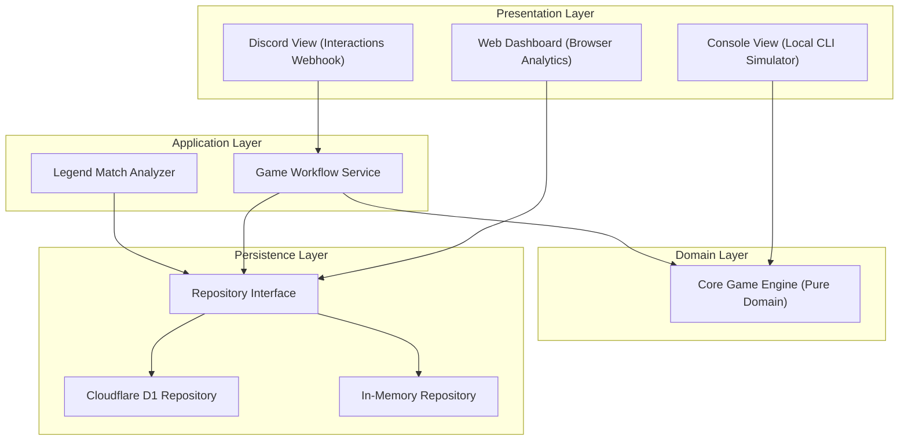

# Project Architecture

This document describes the high-level architecture of the Discord Yachoo game.

## Overview
The application is designed based on clean architecture principles, utilizing functional programming paradigms with TypeScript and `Effect.ts`. It runs on serverless infrastructure using Cloudflare Workers and Cloudflare D1.

---

## Architecture Layers

### 1. Core Game Engine (Pure Domain)
- Contains all core business logic of the Yachoo game (dice rolling calculation, scoring sheet calculation, game state machine).
- Written using **pure functions** without any side effects or external dependencies (such as Discord API, DB, or File System).
- Guaranteed to be 100% unit-testable.

### 2. Presentation Layer
- Renders the `GameState` to user-facing formats.
- Supports three primary delivery mechanisms:
  - **Console View**: Used for local CLI-based simulation.
  - **Discord View**: Used for rendering interactive Discord messages and buttons.
  - **Web Dashboard**: Browser-based analytics dashboard served from the Worker, providing player profiles, ELO history charts, match replays, and Legend Matches catalog.
- Interfaces are abstracted so that local and production presentations are interchangeable.

### 3. Application Layer
- Orchestrates complex game workflows (challenge creation, dice rolling, score selection, surrender) by coordinating domain logic with persistence and presentation concerns.
- `GameWorkflowService`: The central workflow orchestrator that handles all game interactions, manages game state transitions, updates player statistics, calculates ELO ratings, and coordinates Discord API calls (mention notifications, message updates).
- `LegendMatches`: Analyzes completed match histories to identify and tag remarkable game moments (Comeback Wins, Hot Streaks, Yacht Achievements, Epic Fails).

### 4. Persistence Layer
- Abstracts storage operations (player history, session records) behind repository interfaces.
- Implements:
  - **In-Memory Repository**: For fast, dependency-free local simulations and testing.
  - **D1 Repository**: For production serverless storage targeting Cloudflare D1.

---

## Core Technologies & Paradigms

- **Effect.ts**: Manages side-effects, manages dependency injection (`Context`, `Layer`), and coordinates programmatic pipelines.
- **Safe Error Handling**: Eliminates traditional `try-catch` blocks and runtime `throw` statements. Leverages Effect's native error handling channel and generator syntax (`Effect.gen`).
- **Operational Audit Logging**: Leverages Effect's log annotations to trace system events and operational workflows securely.
- **ELO Rating System**: Calculates competitive ratings on game completion using pure mathematical domains to ensure persistent, fair rankings.
- **Cloudflare Workers**: Powering serverless, event-driven Discord interactions via Webhook POST requests.
- **Cloudflare D1**: Provides serverless SQLite database capabilities for persistent game configurations and match history.
- **Vitest**: Runs fast unit tests against pure game engine domains.
- **Web Dashboard**: Served directly from Workers, featuring player profiles, ELO rating charts (Chart.js), turn-by-turn match replays, and a Legend Matches catalog for remarkable game moments.
- **Legend Matches Analysis**: Pure functions that scan match histories to identify noteworthy events — Comeback Wins (25+ point deficit reversal after round 10), Hot Streaks (5+ consecutive 15+ point turns), Yacht Achievements, and Epic Fails (3+ consecutive 0-point turns).
